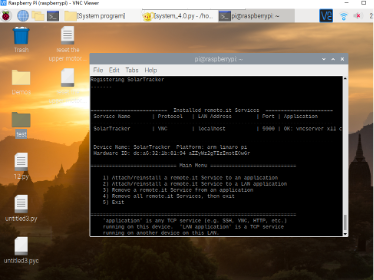
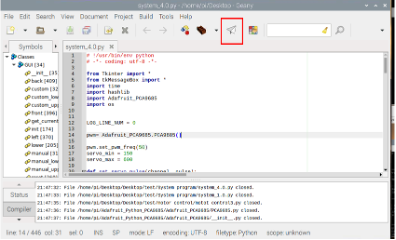
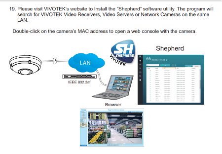

# SolarTracker
By Valen Qiu, contact: valen.qiu@connect.polyu.hk

### Preface
OneDrive Folder: [Solar Tracker](https://connectpolyu-my.sharepoint.com/:f:/g/personal/20083971d_connect_polyu_hk/EpspQ4KWl9xGvHiiFKB0CRsBsq69lWfJ5u-4mAkCwqDmDQ)
Before using it, please download the `VNC viewer` and `remote. it` (or use `remote.it online`) on your computer and sign up/in an account.

<div align=center>

</div>

## I.	Connect methods
  1.	Direct connection: 
    Connect the raspberry pi with the monitor, mouse, and keyboard
  2.	Remote connection via local network: 
    Connect your computer and raspberry pi to the same local network, download & open the VNC viewer and connect it by inputting the IP address of raspberry pi; or connect the computer to the switch in the plastic case (use cable), and do the above step
  3.	Remote connection via Internet: 
    Find a way to access the raspberry pi first, open the VNC server, sign in with your VNC account, and add it to your Team. After finishing it, you can remote connect the raspberry pi through any internet environment (if and only if the raspberry pi is turned on and connected to the internet, Lol)

## II.	Solar Tracker Introduction
The solar tracker is developed based on Raspberry Pi 4B, and the operating system is Raspbian OS (Linux). The raspberry pi is powered up by a rechargeable lithium battery, allowing the device to work for around 2-3 hours even when the power goes out. 

All power and network are provided by the white plastic box connected to the tracker. A switch and router (very old, provided by Mr. Yuen KO, not stable, lol) are placed inside the box for networking, and the IP address is fixed (depends on which port you connect). 

There are only two servo motors as actuators; one is a 360-degree rotatable 25kg*cm servo motor for controlling the azimuth angle (θ). The other is a 180-degree rotatable 60kg*cm servo motor (the torque is large because the camera/sensor is heavy) for controlling zenith angle (φ). Both motors have a certain waterproof ability. 

<div align=center>

</div>

The tracker has a certain waterproof ability, but it has not been specifically tested, and it is recommended not to use it in extreme weather or rain. If it must be used in the above weather, it is recommended to take additional waterproof measures.

## III.	Cables connection
The cables are shown in below images. To use it, please connect the wires following the right hand side image, which just need to connect the ethernet cable and power source with the tracker.

<div align=center>

</div>

## IV.	Connect Solar Tracker
#### 1.	Local Network
1.1.	Connect a monitor to raspberry pi and connect it to the internet. You can also connect your computer to the switch inside the box (highly recommended so that you can know whether the router is working normally, if the router is not well, reboot it until your computer can connect to the Internet). Click the terminal icon (or use `Ctrl + Alt + T`) to open the terminal.


Input:
```
ifconfig
```
The IP address will appear; in this case, the IP address is 192.168.1.23


1.2.	Open the `VNC viewer`.


1.3.	Right-click and choose `“New Connection”`.


1.4.	Input the IP address you get (192.168.1.23 in this case) to the VNC Server, and then click OK. If you want to specify the connection, you can input the name you wish to in the Name.


As shown in the image below, a new connection has been successfully created.


1.5.	Double-click the connection icon you just created, input the user name and password into the window, and click OK.
```
Username: pi
Password: 0
```


1.6.	Connect successfully!


#### 2. Internet

To connect the raspberry conveniently, you can sign up for a VNC account by email and add the raspberry pi to your Team. After doing this, you can directly connect to your raspberry pi, you do not need to be on the same network. As shown in the image. The detail method can be searched online.


#### 3. Remote.it
Besides, it is highly recommended to use Remote.it to detect the internet connection. Besides, it can also get the ethernet IP address. 


With the ethernet IP address, you can repeat step 1.4, but input this ethernet IP address, you can also remotely connect the raspberry pi, and no need to connect to the same local network.


Link for the video tutorial on applying Remote.it: https://www.youtube.com/watch?v=_B8E1dE5kW4&t=167s. 

Some steps for setting up Remote.it are shown below:



## V. Functions: Scanning, Angle Control, Camera...
After accessing the raspberry pi, click the system_4.0.py on the desktop, and run it.
Remarks: please use Geany to run the code. The system is developed under the Geany, and cannot guarantee that other programmers will not report errors.


Since the tracker may need further improvement, the code is not encapsulated into an exe.



fter running the program, GUI will come out.


#### 1. User manual for the GUI:


##### SCAN


Click the `SCAN` button, a window will come out. Click OK for starting, and click Cancel to stop it. The Solar Tracker will start with default settings (10 degrees of Zenith and 6 degrees of Azimuth for each step, scan time is 60s (for testing, only 2s). 


Click the `STOP` button can quit the scanning mode after the initialization. When it is in the scanning mode, other functions will be forbidden.
“Break Time” is not available now. Input the scan time to adjust the time for scanning (input number should be integer and larger than 0), input the azimuth/zenith interval to adjust the angel interval of each step (azimuth: integer in range 0-360, which preferably 360 can be divisible by the integer; zenith: integer in range 0-90, which preferably 90 can be divisible by the integer).
After inputting the numbers for adjustment, click “SCAN” again, the Solar Tracker will start with the new settings. You can input a specific one/two, and others will keep in the default setting.
The initialization angle is Zenith: 90°, Azimuth: 0°, see the definition of zenith and azimuth in part II.

##### MANUAL

Click the `MANUAL` button, wait it for the initialization, those four buttons on the right side of the GUI will be available, and the Solar Tracker can be controlled by those buttons. Each click of the button will let the Solar Tracker move 2° in the corresponding direction.


When the Solar Tracker is in the manual control mode, other functions will be forbidden, you can click the `MANUAL` button again to quit the mode, and other functions will become available.


##### CUSTOM

Type the angle you want in the `Angle` input panel, and click the `CUSTOM` button, the Solar Tracker will turn to the angle. However, the user must enter both azimuth and zenith to set the custom angle, otherwise, it will ask you to input an angle and end this function.

##### RESET

Click the `RESET` button will clean all the input and the setting will become back to the default mode.

`Remark: After testing, please go to the code, and change the scan time to 60s for each step (now is 2s).`

#### 2. Camera

The fisheye camera used here is for simulating the sensor, in case you want to access the image of the camera, here is the way to do it.

In the GUI, click the `SCAN IP ADDRESS`, and wait for a while. It will scan the IP address and MAC address of devices which connected to the local network. 


After clicking it, go the command window, and wait for the result (because of the system permission restrictions, can only read the result in command window)


The MAC address of the fisheye camera is `00:02:d1:93:bd:f9`, therefore, the IP address of it is 192.168.1.22. 

Go to the browser, and then input the IP address, go to the web server of fisheye camera.


```
Username: root
Password: SolarTracker2021
```
And you can access the camera, and there are different modes (see below).


1O mode:


1R mode:


1P mode:


## VI. Device Information

#### 1. Fisheye Camera

`Vivotewk FE9380-HV`, (see the attached user manual) 


https://webapi.vivotek.com/api/DownloadCenter/Download/global?p1=%2B9U3MHUKXPMhaaUnmBD60g==&p2=j199RdC0wOvZ8pPmTck8Tg==

The fisheye camera can be powered and connected to the internet through PoE (power over Ethernet) by an ethernet cable. Therefore, in order to use it, a switch with PoE is required (see part 2) and obeys the IEEE 802.3af. Besides, it also needs to use software called `Shepherd` (Shepherd 2.4.0.201) or a web browser to assess the video. 



The software is in the attached folder, or use this link to download it: https://www.vivotek.com/downloads/product

remarks: `Version 2.4.2.201`


#### 2. PoE Switch

`TL-SG105PE`


This is the Poe connection format:


It also has software to do some settings, the software is attached in the folder as well.


```
Username: admin
Password: admin1
```

#### 3. Router
Provided by Mr. Yuen KO, a very old router, sometimes it fails, but usually, it can work well.

```
Username: (None)
Password: 0000
```


#### 4. MAC Addresses

To identify all devices, which connected in the local network, all MAC addresses are listed here:
```
Router: 00:90:cc:9f:c9:40	
PoE Switch: 60:a4:b7:36:02:d9
Fisheye Camera: 00:02:d1:93:bd:f9
```

#### 5. Raspberry Pi GPIO


## VII. Attatchments

Please check the OneDrive project folder: [Solar Tracker](https://connectpolyu-my.sharepoint.com/:f:/g/personal/20083971d_connect_polyu_hk/EpspQ4KWl9xGvHiiFKB0CRsBsq69lWfJ5u-4mAkCwqDmDQ?e=ZbBOwc)

#### 1. CAD
`Sheet metal.rar`: .DXF files for sheet metal manufacturing
`Tracker_Assembly.zip`: SolidWorks files of the tracker, made by sw2021
`SolarTracker_eDrawing.easm`: eDrawing of the tracker

#### 2. Code
`SolarTracker.py`: Python code for the GUI & control
Using `python 2.7.16`
Need to install libraries: `Tkinter`, `hashlib`, `Adafruit_PCA9685`

#### 3. Fisheye Camera
Documents for the fisheye camera, includes user manual, datasheet, engineering drawing and shepherd user manual

#### 4. PoE Switch
Installation package of the software for setting up the PoE switch.

#### 5.	Shepherd_2.4.0.201
Installation package of the Shepherd_2.4.0.201


